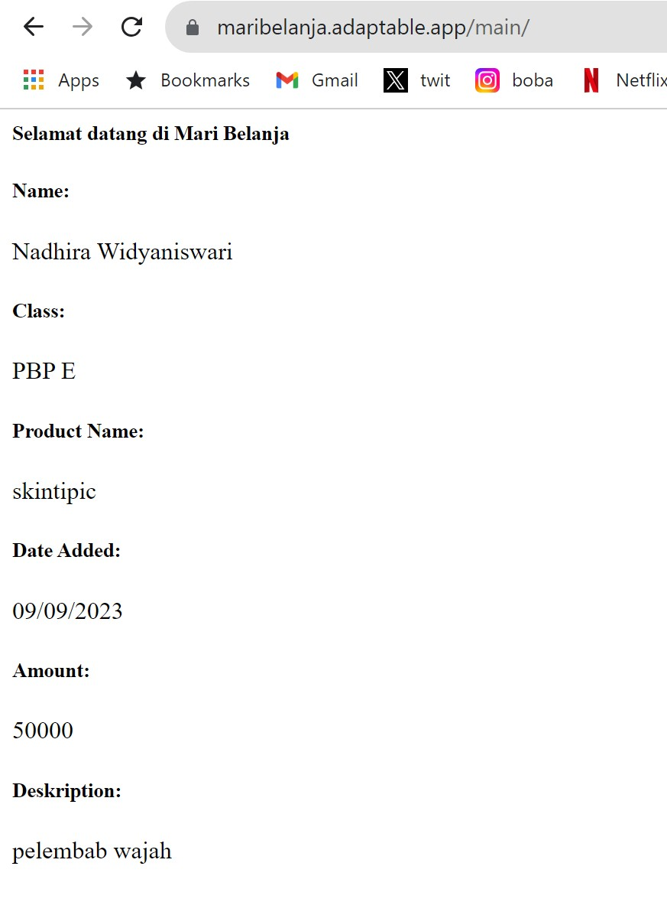

**Tugas 2 Pemrograman Berbasis Platform**
- Nama    :Nadhira Widyaniswari
- NPM     :2206811884
- Kelas   :PBP E
- Link deploy: https://maribelanja.adaptable.app/main/

**Jelaskan bagaimana cara kamu mengimplementasikan checklist di atas secara step-by-step**
 - Inti pada tugas 2 ini adalah membuat proyek dan aplikasi baru sebagai implementasi tutorial yang telah dikerjakan. Langkah pertama yang saya lakukan adalah membuat direktori lokal pada laptop saya dimana nantinya saya akan mengerjakan proyek django dan sinkronisasi dengan direktori online di github. Lalu pada direktori utama saya membuka command prompt dan melakukan inisiasi github karena nantinya akan dilakukan push/pull sinkronisasi antara penyimpanan lokal dan online. Saya juga menambahkan README.md yang merupakan file ini untuk mempermudah pembukaan link deploy.
 - Beberapa langkah yang perlu dihafal ketika setiap kali membuat perubahan adalah add, commit, push, clone, dan pull. Langkah tersebut untuk mengubah pembaruan dari direktori lokal ke direktori online maupun mendapatkan perubahan dari direktori online pada direktori lokal. Langkah ini juga sangat berguna apabila nanti kita lupa untuk membawa laptop tapi ingin meminjam laptop teman untuk mengerjakan tugas. Langkah selanjutnya adalah membuat repositori berupa direktori online tempat kita menyamakan kedua direktori. Setelah itu kita dapat membuat branch baru untuk memisahkan apabila ingin mempunya perubahan atau pengadaan fitur baru seperti cabang pada umumnya. Dimana nantinya kita bisa menggabungkan dan melakukan sinkronisasi terhadap kedua branch dan menggunakan fitur lainnya yang ada di git.
 - Pada mata kuliah ini, kita menggunakan framework yaitu Django sebagai platform untuk mendeploy hasil kerja dari github. Maka langkah pertama yang digunakan adalah menghubungkan akun django dengan repositori github. Kita perlu mengaktifkan bantuan virtual environment untuk mengisolasi, dimana pada kasus ini kita menggunakan vitual environment untuk mengisolasi python ketika ada perbedaan versi atau beberapa proyek dalam satu sekaligus untuk memudahkan portabiltas kerja. Hal selanjutnya yang dilakukan adalah instalasi package, library, dan framework yang dibutuhkan seperti django, gunicorn, whitenoise, psycopg2-binary, request, urllib3 dan membuat project baru dengan nama mari belanja. Setelah itu setting siapa saja host yang dapat mengakses aplikasi nantinya. Kita dapat mencoba dengan cara menjalankan server untuk melihat apakah aplikasi Django telah berhasil berjalan di laptop dengan local host. Setelah itu bisa matikan server dan virtual environtment
 - Setelah itu kita perlu menghubungkan proyek dengan repositori dengan cara memberikan konfigurasi .gitignore yang perlu diabaikan oleh git dalam menjalankan kontrol proyek. Baru kita dapat melakukan pembuatan deployment adaptable. Dengan cara membuat aplikasi baru dan hubungkan dengan repositori terkait. Pada kasus ini saya menghubungkan dengan repositori mari belanja dan pilih template aplikasi yaitu bahasa Python serta database PostgreSQL setelah itu start command dan mulai deploy dan coba buka nama aplikasi yang telah dipilih, Jika sudah muncul roket maka deployment telah berhasil.
 - Hal kedua yang dilakukan adalah kita ingin menampilkan tulisan pada tautan yang telah kita deploy sebagai awal percobaan tugas ini. Terdapat tiga kata kunci yaitu MVT, model-view-template yang akan kita rubah dalam membuat layar baru yang berisi tulisan yang kita inginkan. Dimana ketika kita mengubah file model yang berarti logika dalam proyek dan aplikasi, View merupakan perubahan untuk tampilan user, dan template yang menjadi penentu bagaimana tulisan-tulisan akan ditempatkan. Tujuan dari hal ini adalah membedakan file yang dipakai pengerjaan tugas dapat lebih mudah dan terarah dan tidak tercampur jadi satu.
 - Kita perlu mengaktifkan virtual environment untuk mengisolasi python dan membuat aplikasi baru, di sini saya menggunakan nama 'main' dan kita perlu melakukan konfigurasi pada salah satu file agar aplikasi kita terdaftar. Tepatnya pada direktori mari belanja bagian setting.py. Lalu kita membuat template berbasis bahasa html untuk menampilkan dan melakukan konfigurasi detail tulisan/isi apa saja yang ingin ditampilkan. Saya menambahkan direktori baru bernama templates yang saya buat di dalam direktori lokal aplikasi main dan saya tambahkan bahasa html yang berisi selamat datang, nama dan NPM saya, dan informasi dari salah satu produk yang saya jual. Setelah itu saya mencoba membuka file tersebut untuk melihat tampilan apa yang akan muncul. Namun karena saya belum melakukan git add, commit, dan push maka hal tersebut masih berubah dalam lokal saya saja.
 - Saya menambahkan atribut name, amount, dan description pada file models yang nantinya dapat dipakai untuk instansiasi produk baru secara otomatis dan merubah file view.py untuk mengganti nama produk dan detailnya. Karena pada tugas ini saya belum mengerti bagaimana mengaitkan class pada python dan html. Setelah mengganti salah satu produk yang saya gunakan adalah skintipic, saya mencoba untuk melakukan git add, commit, dan push untuk sinkronisasi perubahan yang saya lakukan dengan direktori online dan saya melakukan deploy ulang hingga tampilan pada web saya berubah menjadi seperti ini.

Setelah memastikan hal tersebut terjadi. Saya telah berhasil melakukan deploy dan perubahan.

**Buatlah bagan yang berisi request client ke web aplikasi berbasis Django beserta responnya dan jelaskan pada bagan tersebut kaitan antara urls.py, views.py, models.py, dan berkas html.**

- Model View Template merupakan salah satu konsep yang digunakan dalam pengembangan aplikasi. Dimana sudah menjadi hal yang umum untuk menggunakan konsep ini karena terdapat pemisahan beberapa aspek penting menjadi tiga yaitu model, view, dan template.
- Pada bagan, nomor satu menggambarkan user yang sedang meminta request http pada django dimana nantinya pada nomor dua perintah akan direquest tampilan berupa view. File ini juga dapat dirubah pada view.py yang akan menampilkan tampilan yang berisi data yang akan ditampilkan. Dimana data tersebut diambil ketika mengakses models.py yang berisi atribut-atribut yang akan digunakan yang telah disimpan pada database (5). Template berfungsi sebagai pengatur tampilan antar muka misal besar kecilnya tulisan, posisi tulisan dengan bahasa html yang dipisahkan dengan logika perhitungan pada models yang disusun pada view. Setelah itu baru view mengembalikan tampilan pada URLs(8) yang dapat dilihat oleh user(9). Sehingga ketiga logika ini models, view, dan template saling bergantung karena memang tujuan dari pemisahan ini adalah memungkinkan pengembang untuk bisa bekerja secara terpisah dan lebih teratur dalam mengembangkan aplikasi

**Jelaskan mengapa kita menggunakan virtual environment? Apakah kita tetap dapat membuat aplikasi web berbasis Django tanpa menggunakan virtual environment?**
- Fungsi utama penggunaan virtual environment adalah untuk mengisolasi package-package ataupun versi python (dalam kasus ini) agar tidak tercampur satu dengan yang lainnya. Mungkin hal ini tidak terlalu berpengaruh apabila kita hanya mengerjakan satu proyek, namun jika sudah lebih dari satu, akan ada kemungkinan bercampur versi dan package-package tersebut yang membuat error dalam pengerjaan. Mengatur konfigurasi juga penting dalam mengerjakan proyek, perbedaan dalam konfigurasi bisa saja berpengaruh dalam pengerjaan tugas. Seperti penjelasan diatas, kita bisa tetap membuat aplikasi web berbasis Django tanpa virtual environment tapi perlu cermat dalam versi konfigurasi yang dipakai.

**Jelaskan apakah itu MVC, MVT, MVVM dan perbedaan dari ketiganya.**
- MVC merupakan Model View Controller. Dimana pada models akan mengatur logika dan atribut apa saja yang dipakai, lalu juga validasi data. Sementara view mengatur isi/data kepada user. Sementara controller berfungsi untuk mengontrol kedua hal tersebut. Misal bagaimana cara memprosesnya, pengaturan iput, alur, dan masih banyak lagi.
MVT merupakan Model View Template. Mirip dengan MVC, namun di sini tidak terdapat controller melainkan terdapat templates yang dapat mengatur tampilan layar dan penempatan tulisan pada web sehingga view hanya mengatur isi dari data yang diambil dari models
MVVM merupakan Model View ViewModel. Apabila anda ingin fokus pada tampilan aplikasi dapat menggunakan metode ini untuk membuat aplikasi yang akan berjalan dengan lancar dari segi antarmuka seperti pengaturan button. View model akan berada ditengah antara view dan model sebagai jembatan penghubung satu dengan yang lainnya.
- Ketiganya merupakan design pattern dan konsep dalam mengembangkan aplikasi ataupun perangkat lunak untuk mengorganisir logika pemprograman yang ada. Perbedaan dari ketiganya adalah bagaimana pola dan konsep dari pengembang dalam mengerjakan aplikasinya apakah ingin memisahkan data dengan kode tampilan atau fokus kepada tampilan saja. Jika ingin berfokus pada tampilan, dapat menggunakan MVVMM. Namun apabila ingin fokus kepada keduanya yaitu logika aplikasi dan tampilan serta flow dalam pemrograman bisa menggunakan MVC dan MVT

**Referensi**
 - Goswami, Vivek. “Coding Ninjas Studio.” Www.codingninjas.com, 30 June 2023, www.codingninjas.com/studio/library/difference-between-mvc-mvp-and-mvvm-architecture-in-android. Accessed 13 Sept. 2023.
