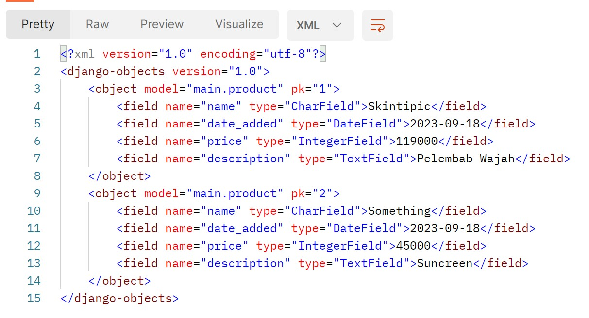
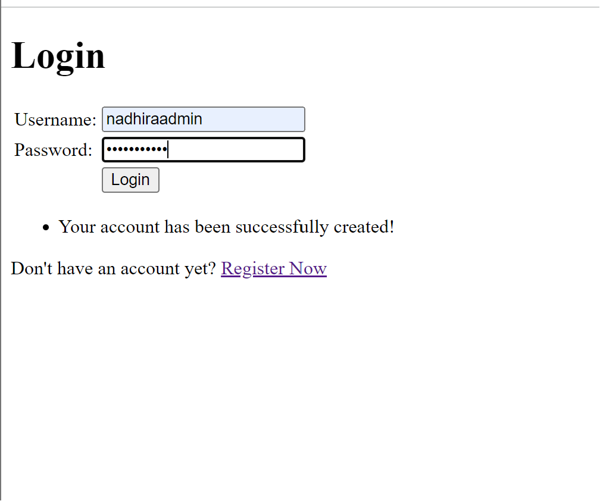

**Tugas 2 Pemrograman Berbasis Platform**
- Nama    :Nadhira Widyaniswari
- NPM     :2206811884
- Kelas   :PBP E
- Link deploy: https://maribelanja.adaptable.app/main/

**Jelaskan bagaimana cara kamu mengimplementasikan checklist di atas secara step-by-step**
 - Inti pada tugas 2 ini adalah membuat proyek dan aplikasi baru sebagai implementasi tutorial yang telah dikerjakan. Langkah pertama yang saya lakukan adalah membuat direktori lokal pada laptop saya dimana nantinya saya akan mengerjakan proyek django dan sinkronisasi dengan direktori online di github. Lalu pada direktori utama saya membuka command prompt dan melakukan inisiasi github karena nantinya akan dilakukan push/pull sinkronisasi antara penyimpanan lokal dan online. Saya juga menambahkan README.md yang merupakan file ini untuk mempermudah pembukaan link deploy.
 - Beberapa langkah yang perlu dihafal ketika setiap kali membuat perubahan adalah add, commit, push, clone, dan pull. Langkah tersebut untuk mengubah pembaruan dari direktori lokal ke direktori online maupun mendapatkan perubahan dari direktori online pada direktori lokal. Langkah ini juga sangat berguna apabila nanti kita lupa untuk membawa laptop tapi ingin meminjam laptop teman untuk mengerjakan tugas. Langkah selanjutnya adalah membuat repositori berupa direktori online tempat kita menyamakan kedua direktori. Setelah itu kita dapat membuat branch baru untuk memisahkan apabila ingin mempunya perubahan atau pengadaan fitur baru seperti cabang pada umumnya. Dimana nantinya kita bisa menggabungkan dan melakukan sinkronisasi terhadap kedua branch dan menggunakan fitur lainnya yang ada di git.
 - Pada mata kuliah ini, kita menggunakan framework yaitu Django sebagai platform untuk mendeploy hasil kerja dari github. Maka langkah pertama yang digunakan adalah menghubungkan akun django dengan repositori github. Kita perlu mengaktifkan bantuan virtual environment untuk mengisolasi, dimana pada kasus ini kita menggunakan vitual environment untuk mengisolasi python ketika ada perbedaan versi atau beberapa proyek dalam satu sekaligus untuk memudahkan portabiltas kerja. Hal selanjutnya yang dilakukan adalah instalasi package, library, dan framework yang dibutuhkan seperti django, gunicorn, whitenoise, psycopg2-binary, request, urllib3 dan membuat project baru dengan nama mari belanja. Setelah itu setting siapa saja host yang dapat mengakses aplikasi nantinya. Kita dapat mencoba dengan cara menjalankan server untuk melihat apakah aplikasi Django telah berhasil berjalan di laptop dengan local host. Setelah itu bisa matikan server dan virtual environtment
 - Setelah itu kita perlu menghubungkan proyek dengan repositori dengan cara memberikan konfigurasi .gitignore yang perlu diabaikan oleh git dalam menjalankan kontrol proyek. Baru kita dapat melakukan pembuatan deployment adaptable. Dengan cara membuat aplikasi baru dan hubungkan dengan repositori terkait. Pada kasus ini saya menghubungkan dengan repositori mari belanja dan pilih template aplikasi yaitu bahasa Python serta database PostgreSQL setelah itu start command dan mulai deploy dan coba buka nama aplikasi yang telah dipilih, Jika sudah muncul roket maka deployment telah berhasil.
 - Hal kedua yang dilakukan adalah kita ingin menampilkan tulisan pada tautan yang telah kita deploy sebagai awal percobaan tugas ini. Terdapat tiga kata kunci yaitu MVT, model-view-template yang akan kita rubah dalam membuat layar baru yang berisi tulisan yang kita inginkan. Dimana ketika kita mengubah file model yang berarti logika dalam proyek dan aplikasi, View merupakan perubahan untuk tampilan user, dan template yang menjadi penentu bagaimana tulisan-tulisan akan ditempatkan. Tujuan dari hal ini adalah membedakan file yang dipakai pengerjaan tugas dapat lebih mudah dan terarah dan tidak tercampur jadi satu.
 - Kita perlu mengaktifkan virtual environment untuk mengisolasi python dan membuat aplikasi baru, di sini saya menggunakan nama 'main' dan kita perlu melakukan konfigurasi pada salah satu file agar aplikasi kita terdaftar. Tepatnya pada direktori mari belanja bagian setting.py. Lalu kita membuat template berbasis bahasa html untuk menampilkan dan melakukan konfigurasi detail tulisan/isi apa saja yang ingin ditampilkan. Saya menambahkan direktori baru bernama templates yang saya buat di dalam direktori lokal aplikasi main dan saya tambahkan bahasa html yang berisi selamat datang, nama dan NPM saya, dan informasi dari salah satu produk yang saya jual. Setelah itu saya mencoba membuka file tersebut untuk melihat tampilan apa yang akan muncul. Namun karena saya belum melakukan git add, commit, dan push maka hal tersebut masih berubah dalam lokal saya saja.
 - Saya menambahkan atribut name, amount, dan description pada file models yang nantinya dapat dipakai untuk instansiasi produk baru secara otomatis dan merubah file view.py untuk mengganti nama produk dan detailnya. Karena pada tugas ini saya belum mengerti bagaimana mengaitkan class pada python dan html. Setelah mengganti salah satu produk yang saya gunakan adalah skintipic, saya mencoba untuk melakukan git add, commit, dan push untuk sinkronisasi perubahan yang saya lakukan dengan direktori online dan saya melakukan deploy ulang hingga tampilan pada web saya berubah menjadi seperti ini.

Setelah memastikan hal tersebut terjadi. Saya telah berhasil melakukan deploy dan perubahan.

**Buatlah bagan yang berisi request client ke web aplikasi berbasis Django beserta responnya dan jelaskan pada bagan tersebut kaitan antara urls.py, views.py, models.py, dan berkas html.**

- Model View Template merupakan salah satu konsep yang digunakan dalam pengembangan aplikasi. Dimana sudah menjadi hal yang umum untuk menggunakan konsep ini karena terdapat pemisahan beberapa aspek penting menjadi tiga yaitu model, view, dan template.
- Pada bagan, nomor satu menggambarkan user yang sedang meminta request http pada django dimana nantinya pada nomor dua perintah akan direquest tampilan berupa view. File ini juga dapat dirubah pada view.py yang akan menampilkan tampilan yang berisi data yang akan ditampilkan. Dimana data tersebut diambil ketika mengakses models.py yang berisi atribut-atribut yang akan digunakan yang telah disimpan pada database (5). Template berfungsi sebagai pengatur tampilan antar muka misal besar kecilnya tulisan, posisi tulisan dengan bahasa html yang dipisahkan dengan logika perhitungan pada models yang disusun pada view. Setelah itu baru view mengembalikan tampilan pada URLs(8) yang dapat dilihat oleh user(9). Sehingga ketiga logika ini models, view, dan template saling bergantung karena memang tujuan dari pemisahan ini adalah memungkinkan pengembang untuk bisa bekerja secara terpisah dan lebih teratur dalam mengembangkan aplikasi

**Jelaskan mengapa kita menggunakan virtual environment? Apakah kita tetap dapat membuat aplikasi web berbasis Django tanpa menggunakan virtual environment?**
- Fungsi utama penggunaan virtual environment adalah untuk mengisolasi package-package ataupun versi python (dalam kasus ini) agar tidak tercampur satu dengan yang lainnya. Mungkin hal ini tidak terlalu berpengaruh apabila kita hanya mengerjakan satu proyek, namun jika sudah lebih dari satu, akan ada kemungkinan bercampur versi dan package-package tersebut yang membuat error dalam pengerjaan. Mengatur konfigurasi juga penting dalam mengerjakan proyek, perbedaan dalam konfigurasi bisa saja berpengaruh dalam pengerjaan tugas. Seperti penjelasan diatas, kita bisa tetap membuat aplikasi web berbasis Django tanpa virtual environment tapi perlu cermat dalam versi konfigurasi yang dipakai.

**Jelaskan apakah itu MVC, MVT, MVVM dan perbedaan dari ketiganya.**
- MVC merupakan Model View Controller. Dimana pada models akan mengatur logika dan atribut apa saja yang dipakai, lalu juga validasi data. Sementara view mengatur isi/data kepada user. Sementara controller berfungsi untuk mengontrol kedua hal tersebut. Misal bagaimana cara memprosesnya, pengaturan iput, alur, dan masih banyak lagi.
MVT merupakan Model View Template. Mirip dengan MVC, namun di sini tidak terdapat controller melainkan terdapat templates yang dapat mengatur tampilan layar dan penempatan tulisan pada web sehingga view hanya mengatur isi dari data yang diambil dari models
MVVM merupakan Model View ViewModel. Apabila anda ingin fokus pada tampilan aplikasi dapat menggunakan metode ini untuk membuat aplikasi yang akan berjalan dengan lancar dari segi antarmuka seperti pengaturan button. View model akan berada ditengah antara view dan model sebagai jembatan penghubung satu dengan yang lainnya.
- Ketiganya merupakan design pattern dan konsep dalam mengembangkan aplikasi ataupun perangkat lunak untuk mengorganisir logika pemprograman yang ada. Perbedaan dari ketiganya adalah bagaimana pola dan konsep dari pengembang dalam mengerjakan aplikasinya apakah ingin memisahkan data dengan kode tampilan atau fokus kepada tampilan saja. Jika ingin berfokus pada tampilan, dapat menggunakan MVVMM. Namun apabila ingin fokus kepada keduanya yaitu logika aplikasi dan tampilan serta flow dalam pemrograman bisa menggunakan MVC dan MVT

**Referensi**
 - Goswami, Vivek. “Coding Ninjas Studio.” Www.codingninjas.com, 30 June 2023, www.codingninjas.com/studio/library/difference-between-mvc-mvp-and-mvvm-architecture-in-android. Accessed 13 Sept. 2023.

-------------------------------
**Tugas 3**

**Apa perbedaan antara form POST dan form GET dalam Django?**
- Setelah mengikuti tutorial 2, saya mendapatkan bahwa perbedaan dari metode POST dan GET adalah

POST | GET
---------|------------
POST digunakan untuk mengirimkan data yang dapat dibilang krusial dan tidak dapat dirubah serta tidak ditampilkan dalam URL sehingga tidak mudah untuk di enkripsi | menampilkan data pada web dari server yang mengembalikan HTTP
POST bisa dipakai untuk memasukkan objek baru seperti pada kasus ini adalah produk barang kecantikan yang memiliki atribut nama, deskripsi, harga, dan tanggal dimasukkannya product | Pengiriman data dalam bentuk query string dimana nanti setiap produk saat ini memiliki ID untuk kemudahan untuk mengakses lewat URL
Ukuran data yang ditransfer tidak memiliki batasan sehingga aman jika ingin mengirimkan data yang besar | Memiliki batasan ukuran apabila mengirimkan data lewat URL
Dapat memodifikasi atau mengubah server, misal perbaikan deskripsi produk | Tidak memodifikasi server

**Apa perbedaan utama antara XML, JSON, dan HTML dalam konteks pengiriman data?**
XML | JSON | HTML
----------|----------------|--------------
Dari segi sintaks, XML documents harus memiliki root | Sintaks berkaitan dengan JavaScripts objects lalu key-value {}| penulisan struktur dari halaman web secara sematik, memiliki start tag, element content, dan end tag <>
Dapat digunakan dalam berbagai macam aplikasi untuk pertukaran data, konfigurasi, simpan dokumen | Fokus pada pengembangan web dan API RESTful, JSON biasa dipakai pada web modern karena kemudahannya. | digunakan untuk menampilkan halaman web
Fokus pada penyimpanan dan data struktural. Misal pada pertukaran data aplikasi dan sistem yang berbeda | Fokus pada objek (karena basisnya JavaScripts) dan mudah dibaca oleh manusia. Dapat digunakan untuk pengembangan web dan layanan web | basis dasar rancangan User interface dengan tampilan web
Umum digunakan untuk pengiriman data | Umum digunakan untuk pengiriman data |kurang umum untuk digunakan pengiriman data

**Mengapa JSON sering digunakan dalam pertukaran data antara aplikasi web modern?**
- Menurut saya, dari beberapa gambar yang saya dapatkan dari metode GET di postman, saya merasa bahwa JavaScript Object Notation mudah untuk dibaca dan format yang digunakan dalam bahasa pemrograman cukup mudah berupa dictionary pasangan key dan value. Lalu pada JSON dapat digunakan bahasa pemrograman lain seperti PHP, Python, C++, dan Ruby. Pada awalnya bahasa pemrograman ini memiliki dasar JavaScript. Sehingga awal mula popularitas JSON juga diawali denngan banyaknya penggunaan JavaScript. Dan data yang tersimpan dalam JSON dapat digunakan/impor pada JavaScript.

- Dalam gambar yang saya lampirkan di bawah, saya juga membandingkan JSON dengan bahasa lainnya dan merasa seperti menulis biasa namun ditambah petik dua untuk deklarasi key dan value. Pengiriman data JSON juga dinilai cukup cepat dan rendah dalam ukuran sehingga dapat mempercepat waktu untuk pengiriman data. JSON juga fleksibel digunakan untuk pemrograman web, cloud, mobile, dan lain-lain. Tetapi ada pun kekurangan JSON yang perlu dipertimbangkan bahwa kecepatan pengiriman juga akan kurang efisien jika data terlalu besar dan karena kesederhanaanya dalam menulis kode, bisa saja untuk beberapa kasus khusus tipe data yang kompleks tidak tersedia. Dan yang terakhir, kita tidak dapat menambahkan comment pengerjaan pada JSON.

**Jelaskan bagaimana cara kamu mengimplementasikan checklist di atas secara step-by-step**
- Pada tugas 3, hal pertama yang saya lakukan adalah mengubah routing dari main/ ke / agar saat mengakses URL tidak perlu ada tambahan main/ tapi langsung bisa diakses (saat ini pada local host) saya juga mengaktifkan virtual environment untuk mengisolasi python. Lalu saya membuat kerangka view sebagai dasar web pada base.html dan menambahkan hal tersebut pada TEMPLATES di setting agar masuk sebagai setting dan mengubah main.html yang telah diisi pada tugas sebelumnya namun pada kasus ini, main.html tidak lagi menjadi base namun base.html lah yang menjadi dasar
- Setelah itu, saya membuat form baru sebagai atribut input produk yang akan saya tampilkan. Karena saya ingin membuat tabel otomatis, maka saya menambahkan direktori forms.py pada direktori main. Di sini ada atribut nama, harga, dan deskripsi yang harus dimiliki oleh objek produk. Sehingga saat form disimpan, akan langsung masuk dalam class Product. Jangan lupa import fungsi tersebut pada views.py. 
- Lalu tambahkan fungsi baru apabila pengguna berhasil menambahkan produk baru. Jangan lupa tambahkan pastikan isi form valid. Lalu tambahkan fungsi pada show_main agar object Product yang telah dibuat dapat keluar di halaman web. Setelah perubahan, tambahkan path url ke dalam urls.py agar url dapat diakses untuk menambahkan produk.
- Buat create_product.html baru yang berada pada direktori yang sama dengan main.html untuk tampilan dasar. Isi dari file tersebut harus dapat block untuk form dengan metode POST, meliputi security untuk mencegah serangan bahaya, dan membuat tabel hasil dari produk-produk yang telah dimasukkan. lalu juga terdapat pilihan untuk submit produk baru dan menambahkan produk. Pada main.html juga tambahkan kode untuk pembuatan tabel dan tombol untuk nemambahkan produk baru. Setelah itu, saya mencoba untuk membuka di local host laptop saya agar melihat perkembangan yang telah saya lakukan.
- Lalu setelah ini ada cara untuk mengembalikan data yang telah dimasukkan dalam format bahasa XML. Pertama kita masukkan "from django.http import HttpResponse" pada views.py yang terletak pada main. Lalu buat sebuat fungsi yaitu show_xml yang akan menyimpan hasil query data pada object produk yang mengembalikan HttpResponse
- Lalu setiap ada perubahan pada views tambahkan fungsi tersebut pada urls dan masukkan ke dalam path url. Lalu hal yang sama juga dapat dilakukan apabila kita ingin mendapatkan data dalam bahasa JSON. Namun nama fungsinya adalah show_json dan return berupa HTTPResponse dan lalukan penambahan path pada urls.
- Setelah ini saya akan mencoba untuk mengembalikan urls berdasarkan dengan ID dengan menambahkan "data = Product.objects.filter(pk=id)" dan menambahkan fungsi "def show_xml_by_id(request, id):" dan def "show_json_by_id(request, id):" tambahkan fungsi pada urls.py dan path pattern.
- Lalu saya akan mencoba melihat perbedaan bagaimana tampilan web saya dengan bahasa HTML, XML, XML by ID, JSON, dan JSON by ID dengan menggunakan aplikasi Postman yang disetting "GET" dan saya mendapatkan hasil seperti dibawah ini.

**Hasil Screenshoot**
**HTML**

Bagaimana program yang tertulis tampil dengan bahasa HTML cirinya ada start tag, content, dan end tag

**JSON**

**JSON by ID**

JSON memiliki khas key dan value

**XML**

**XML by ID**

Program yang ditulis pada bahasa XML pasti memiliki root

**Referensi**
Safris, Seva. “A Deep Look at JSON vs. XML, Part 1: The History of Each.” Toptal Engineering, 2023, www.toptal.com/web/json-vs-xml-part-1.

---------------------------------------------------
**Tugas 4**
**Apa itu Django UserCreationForm, dan jelaskan apa kelebihan dan kekurangannya?**
- Django UserCreationForm merupakan class dari modul django autentikasi yang dimana class ini sudah bawaan dari django untuk memudahkan pembuatan akun pada user pada sistem autentikasi web. Dimana hal ini bisa meminta nama, password dan konfirmasi password beserta syarat yang baik untuk menjadikan sebuah kata atau kalimat menjadi password yang kuat.
- Kelebihan dari class ini adalah mudah digunakan, karena kita tinggal menulis satu baris yang memanggil class beserta methodnya maka akan langsung tersbuat formulir untuk pengguna mendaftarkan akun. Selain itu, formulir ini masih dapat diatur sesuai dengan keinginan pengembang web misal jika ingin menambah logika untuk verifikasi. Formulir ini juga bawaan dari Django, jadi kita tidak perlu memikirkan bagaimana cara kerja formulir terhadap aplikasi, karena ini merupakan hal umum dimana banyak orang sudah melakukan hal ini. Yang terakhir, dalam formulir ini sudah ada validasi seperti nama dan password yang tidak boleh terlalu mirip, apabila ada bagian yang belum diisi saat pendaftaran, maka akan mengeluarkan error.
- kekurangan dari penggunaan UserCreationForm adalah fitur yang disediakan pada class tersebut masih fungsi dasar sehingga perlu perbaikan lebih lanjut ataupun penambahan fungsi apabila kita ingin membuat verifikasi data yang lebih baik lagi. Lalu juga terdapat kostumisasi yang tidak didukung oleh class ini serta class ini tidak mendukung autentikasi lanjutan seperti nomor hp, email maupun pihak ketiga.

**Apa perbedaan antara autentikasi dan otorisasi dalam konteks Django, dan mengapa keduanya penting?**
- Konsep autentikasi dan otorisasi dalam konteks Django merupakan dua hal yang tidak dapat dipisahkan, karena hal ini berkaitan erat dengan keamanan aplikasi. Sebagai contoh perlu diadakannya verifikasi user untuk mengakses data-data krusial dalam database. Hal ini sangat penting untuk diatur bagi sebuah perusahaan dalam menjaga data pentingnya. Apabila kita mengatur autentikasi dan otorisasi dengan baik maka aplikasi yang kita kembangkan juga semakin baik karena dapat berjalan dengan rapih dan memang sebaiknya akses dalam mengakses aplikasi terbatas agar tidak sembarang orang yang dapat menggunakannya.
- Konsep autentikasi merupakan proses verifikasi pengguna yang akan menggunakan aplikasi anda. Hal ini dapat berupa pengecekkan nama dan password untuk aplikasi yang mungkin bersifat universal karena semakin ketat autentikasi berarti data yang dilindungi oleh aplikasi tersebut sangatlah penting. Apabila terdapat masalah seperti password salah atau tidak sesuai maka pengguna tersebut tidak dapat mengakses beberapa hal dalam aplikasi anda.
- Konsep otorisasi biasanya dijalankan setelah proses autentikasi berhasil. Biasanya admin dari aplikasi akan mengatur apa saja yang boleh dilakukan oleh seseorang yang telah melakukan autentikasi sebelumnya. Apakah ia bisa melihat aplikasi saja atau diberikan akses untuk menghapus data, dan masih banyak lainnya.

**Apa itu cookies dalam konteks aplikasi web, dan bagaimana Django menggunakan cookies untuk mengelola data sesi pengguna?**
- Menurut saya cookies adalah data kecil yang disimpen oleh browser pengguna saat mengunjungi web. Sebagai contoh kita telah login ke dalam suatu aplikasi setelah itu kita membuka tab browser baru kepada aplikasi yang sama, maka terkadang kita diminta lagi untuk login karena data kita belum tersimpan didalamnya. Cookies berfungsi untuk menyimpan informasi yang dapat digunakan untuk mengenali pengguna, seperti preferensi dan keberhasilan autentikasinya. 
- Pada Django, cookies dipakai untuk mengelola sesi pengguna agar data pengguna saat mengunjungi web dapat tersimpan, bisa dicek dibrowser. Biasanya juga terdapat history cookies untuk mengecek history masuk ke dalam aplikasi. Biasanya urutannya adalah pengguna memulai sesi dan datanya disimpan (punya ID), mengirimkan cookie ke browser pengguna dan mengambil data dari server seperti bagaimana user tersebut login, mengupdate dan menakhiri sesi.

**Apakah penggunaan cookies aman secara default dalam pengembangan web, atau apakah ada risiko potensial yang harus diwaspadai?**
Sebenarnya, ketika saya membuka sebuah website, sering kali muncul tulisan "Terima semua cookie", dan sekarang saya memahami bahwa hal tersebut dapat mempermudah saya apabila saya telah memiliki preferensi terhadap suatu web, maka saya dapat menggunakan hal tersebut di masa mendatang ketika saya menggunakan web tersebut, saya tidak perlu mengatur preferensi saya dari awal. Lalu juga saya dapat memeriksa sesi saya sebelumnya dan melakukan pengecekkan terhadap sesi saya sebelumnya, menurut saya itu merupakan hal yang umum diminta oleh web. Namun tidak menutup kemungkinan pada beberapa aplikasi menyalahgunakan perizinan tersebut dengan meminta data-data yang seharusnya tidak boleh disalahgunakan seperti privasi pengguna yang mengakibatkan keamanan data pribadi terancam. Lalu bisa juga memanipulasi aktivitas pemilik yang sah untuk bukti. Hal ini dapat dilakukan dengan memasukkan teks berbahaya saat mengirimkan data ke pengguna.

**Jelaskan bagaimana cara kamu mengimplementasikan checklist di atas secara step-by-step (bukan hanya sekadar mengikuti tutorial).**
- Saya ingin mengimplementasikan fungsi pendaftaran akun untuk admin, login admin, dan logout admin sebagai rencana awal untuk mengatur admin dimana pada program saya sebagai seorang penjual. Caranya adalah menjalankan virtual environment pyhton terlebih dahulu untuk mengisolasi perubahan pada python. Saya menambahkan beberapa impor yang akan saya gunakan seperti redirect untuk kembali ke halaman tertentu, message uuntuk menampilkan pesan, dan yang terakhir adalah UserCreationForm merupakan class yang akan menjadi dasar pembuatan akun. Di sini kita menggunakan nama dan password untuk registasi dan syaratnya telah diatur oleh class ini. Saya menambahkan fungsi register yang akan berisi kode untuk membuat fungsi tersebut dan validasi kalau akun baru berhasil dibuat apabila form tersebut valid dan keluar pesan telah berhasil membuat akun.
- Setelah mengatur logika pada views.py, kita harus mengatur templates sebagai tempat dimana logika tersebut diletakkan. Saya menambahkan register.html yang berisi halaman bagaimana halam register tersebut. Lalu seperti biasa kita perlu menambahkan path pada urls.py sebagai halaman kita yaitu register/. Setelah dari fungsi register, kita perlu mengatur fungsi login untuk akun yang telah mendaftar agar bisa masuk ke dalam aplikasi.
- Saya membuka kembali views.py dan mengimport authenticate, dan login yang merupakan class bawaan dari django. Saya menambahkan fungsi login_user sebagai pengecekkan apabila nama dan password yang dimasukkan apakah sudah sesuai dengan data yang didaftarkan, jika ya maka ia bisa mengakses halaman utama yang pada tugas sebelumnya dapat kita akses tanpa perlu log in. Lalu jangan lupa buat template dasar halaman web ingin seperti apa. Dan tambahkan path login pada urls.py.
- Setelah berhasil membuat kedua fungsi tersebut saya mengimpor class logout pada views.py, dan menambahkan fungsi logout yang mengembalikan pengguna ke halaman login. Saya juga menambahkan tombol log out pada main.html agar tombol tersebut dapat berfungsi dan tambahkan path pada urls.py.
- Setelah berhasil membuat sistem autentikasi di atas, saya akan  membuat otorisasi apa saja bagi pengguna yang berhasil login ke aplikasi. Pada kesempatan kali ini saya akan mengatur bahwa seseorang tersebut dapat mengakses halaman main dengan menambahkan kode @login_required(login_url='/login').
Setelah itu saya akan mencoba menggunakan data dari cookies dengan cara membuka views.py pada direktori main dan mengimpor date time, HttpResponseRedirect, dan reserve. Saya ingin menambagkan kode pada login_user untuk mengambil waktu kapan terakhir pengguna login. Dan setting context agar muncul dalam aplikasi. Jangan lupa tambahkan pada main.html agar muncul dalam tampilan web. Saya juga telah melihat data last_login pada bagian inspect element lalu pada bagian apllication/storage.
- Langkah terakhir yang saya lakukan adalah menghubungkan model product dengan user, dimana setiap user hanya dapat mengakses halaman yang ditambahkannya sendiri. Pada models.py tambahkan class user dan tambahkan kode user = models.ForeignKey(User, on_delete=models.CASCADE). Lalu tambahkan kode pada create_product akan menajdi fokus kepada user, selain itu rubah juga pada show_main agar hanya menampilkan produk yang ditambahkan oleh user yang terkait. Setelah itu saya melakukan migrasi karena tadi saya mengubah models. Dan saya mencoba membuat 2 user yang masing-masing mempunyai 3 barang

Bukti dari saya telah melakukan checklist.

-------------------------------------------
**Tugas 5**
**Jelaskan manfaat dari setiap element selector dan kapan waktu yang tepat untuk menggunakannya.**
- Pada konteks ini, saya akan membahas dalam bahasa CSS (Cascading Style Sheets) dimana kita dapat menggunakan bahasa ini untuk kustomisasi halaman web. Terdapat kemudahan dalam CSS yaitu Element selector yaitu kita dapat mengatur secara berkelompok beberapa item yang memiliki tag HTML yang sama. Misal kita mempunya beberapa huruf dalam tag <h5> dimana kita ingin tulisan kecil muncul dalam halaman web kita. Dan kita bisa setting secara global dalam halaman web tersebut apabila kita ingin tulisan yang memiliki ukuran tersebut memiliki warna, padding, margin yang sama. Seperti dalam tugas ini, saya melihat terdapat peluang untuk menyamakan pada saat saya menggunakan tag pada tabel yang saya buat. 
- Lalu terdapat jenis lain seperti ID selector, kita dapat menambah id = " " lalu menggunakan # untuk penulisannya apabila kita ingin mengelompokan id-id yang sama. Dan terdapat class selector juga untuk menentuka beberapa tag yang memiliki class yang sama. Semua hal tersebut untuk kustomisasi secara efisien jika terdapat beberapa elemen yang memiliki kesamaan warna, margin, dan sebagainya.

**Jelaskan HTML5 Tag yang kamu ketahui.**
- HTML5 merupakan produk kembangan dari HTML sebelumnya yang telah memiliki perkembangan sesuai dengan 
web moder, seperti dapat lebih interaktif dalam web. Beberapa tag baru adalah <video> dan <audio> yang dapat memasukkan video dan audio ke dalam halaman web. 
- Beberapa hal lainnya terdapat validasi seperti email untuk input, pengecekkan nomor telepon yang dapat mempermudah validasi input. Dalam HTML 5 juga terdapat penyimpanan kecil dari aplikasi web dari sisi pengguna. Ini dapat menjadi subsitusi penggunaaan cookies. Secara penulisan juga dapat lebih sederhana menjadi bagian bagian seperti header, artickle, nav, footer tidak perlu pakai class seperti HTML. Improvisasi semantik pada elemen juga berkembang pada HTML5. Dan perkembangannya dari tahun 2015 hingga sekarang yang sudah meningkatnya kemudahan untuk mengakses API.
**Jelaskan perbedaan antara margin dan padding.**
- Perbedaan antara margin dan padding, dalam hal ini saya membahasnya dalam konteks CSS adalah margin merupakan jarak antara container terluar dengan content di dalamnya seperti box-box dalam user interface. Margin merupakan jarak diluar dari border dengan misal ukuran ps dari layar laptop. Ukuran border dapat berisi angka negatif ataupun bilangan tidak bulat
- Sementara itu padding merupakan jarak content dengan border (pemahaman saya) dimana border merupakan kotak awal maka misal terdapat isi dari border ke tulisan itulah yang dinamakan padding. Nilai padding tidak dapat dikustom secara otomatis dan tidak bisa bernilai negatif.

**Jelaskan perbedaan antara framework CSS Tailwind dan Bootstrap. Kapan sebaiknya kita menggunakan Bootstrap daripada Tailwind, dan sebaliknya?**
- Untuk melakukan pengembangan tampilan dalam halaman web. Kita dapat menggunakan framework CSS yang cukup populer seperti bootstrap dan Tailwind. Terdapat perbedaan secara umum antara kedua framework tersebut dimana dalam menggunakan bootstrap terdapat komponen siap pakai sehingga tidak perlu menuliskan kode ulang secara menyeluruh. Secara umum untuk pemula disarankan untuk menggunakan bootstrap karena memiliki sintaks yang lebih mudah untuk dipahami karena komponen telah didefinisikan, dan karena itu tampilan dapat lebih konsisten. File CSS yang digunakan lebih besar karena sudah banyak komponen yang sudah didefinisikan.
- Sementara itu tailwind membangun komponen tersebut dengan class-class yang didefinisikan sehingga terdapat sedikit perubahan file CSS. Pengembangan dalam tailwind juga sangat luas karena flesibiltas yang tinggi dan pengguna lebih mudah untuk kustomisasi elemen-elemen yang ada. Namun disarankan memiliki pemahaman terhadap bahasa ini karena terdapat banyak hal yang perlu disiapkan dalam mengembangkan proyek

**Jelaskan bagaimana cara kamu mengimplementasikan checklist di atas secara step-by-step (bukan hanya sekadar mengikuti tutorial).**

- Pertama-tama, karena kita ingin menambahkan framework ke dalam proyek, kita perlu menambahkan tag  untuk CSS, bootstrap dan JS. Di sini saya juga menambahkan tailwind karena saya menggunakan framework tersebut. Saya juga menambahkan navbar yang berisi penjualan dan tulisan log in sebagai siapa. Saya juga menambah fitur edit pada program saya agar penjual bisa mengubah harga, deskripsi produk, dan nama produk. Saya menambahkan fungsi pada views.py dan mengatur path pada URL py serta menambahkan base pada edit_product.html.
- Lalu saya mencoba mengatur tampilan dengan memberi warna-warna dasar. Karena saya menggunakan tailwind saya harus menambahkan class-class pada setiap .html seperti setting warna untuk latar bernuansa hijau. Saya mendefinisikan classnya, typenya, warna, padding, ukuran font, dan masih banyak yang lainnya. Saya melakukan semua perubahan pada create_product.html, main.html, login.html, register.html, dan edit_product.html. Saya masih mempelajari bahasa tersebut sehingga pada tugas ini saya baru mengganti tampilan dasar dan mulai belajar apa saja yang bisa dikustomisasi oleh tailwind.

**Referensi**
https://www.hostinger.in/tutorials/difference-between-html-and-html5#:~:text=HTML5%20is%20the%20latest%20version%20of%20HTML%20and%20supports%20new,also%20supports%20audio%20and%20video.&text=HTML%20does%20not%20provide%20native,native%20audio%20and%20video%20support.

https://www.geeksforgeeks.org/css-padding-vs-margin/

**Tugas6**
**Jelaskan perbedaan antara asynchronous programming dengan synchronous programming.**
- Menurut pemahaman saya, asynchronous programming merupakan pendekatan kode dimana urutan kode dijalankan tidak berurutan dan bisa dilakukan bersama-sama. Hal ini sangat berbeda dengan synchronous, dimana program akan dieksekusi secara berurutan sesuai dengan urutan kode yang ditulis. Ketika satu program dieksekusi, maka program lain akan menunggu sampai program pertama selesai untuk dieksekusi. Pemrograman asynchronous biasanya dapat menjadi pemrograman background yang tidak dapat di blocking layaknya latar belakang yang selalu dijalankan, sementara pemrograman synchronous bersifat blocking, dimana ketika suatu program sudah berjalan, program lain akan menunggu dan tidak bisa berjalan hingga program yang sudah berjalan duluan selesai untuk dieksekusi. 
- Terdapat istilah yang sering digunakan dalam pemrograman async dimana terdapat kata await yang membuat kode tersebut seperti kode synchronous. Dalam kode yang saya buat, fungsi getproducts merupakan fungsi async karena kita perlu mendapatkan data product yang ada segera, tidak bisa menunggu program yang lain dijalankan

**Dalam penerapan JavaScript dan AJAX, terdapat penerapan paradigma event-driven programming. Jelaskan maksud dari paradigma tersebut dan sebutkan salah satu contoh penerapannya pada tugas ini.**
- Merupakan pendekatan pemrograman sesuai dengan adanya event, hal ini seperti button-click, gerakan mouse, yang menyebabnya terjadi seperti interupsi alur program. Biasanya respons ini termasuk dalam asychronous, karena membutuhkan respon yang cepat. 
-  Dari proses tersebut terdapat event handling yang dapat melakukan interupsi tersebut. Pada kode saya terdapat kode "document.getElementById("button_add").onclick = addProduct" dimana akan memberikan signal apabila button dengan id tersebut diklik akan memanggil fungsi add product. Kita juga menggunakaannya untuk berkomunikasi dengan server tanpa melakukan refresh saat menambah product. Paradigma ini sangat penting mengingat ingin menciptakan web yang interaktif.

**Jelaskan penerapan asynchronous programming pada AJAX.**
Setelah mengerjakan tugas 6, saya memahami bahwa asynchronous programming pada ajax memungkinkan komunikasi antara server dan klien tanpa mengganggu fungsionalitas atau eksekusi program yang sedang berjalan. Konsep ini sangat penting, salahs atunya pada pengambilan data dari server, agar data terbaru dapat langsung terupdate tanpa membutuhkan waktu yang lama. Kita juga menggunakan asynchronous programming pada saat handle event programming, dimana saya menggunakan click button. Jadi saat saya memencet sebuah button, akan langsung muncul handle dari event tersebut seperti interupsi

**Pada PBP kali ini, penerapan AJAX dilakukan dengan menggunakan Fetch API daripada library jQuery. Bandingkanlah kedua teknologi tersebut dan tuliskan pendapat kamu teknologi manakah yang lebih baik untuk digunakan.**
- Fetch API, merupakan salah satu kembangan Javascript modern yang menurut saya akan lebih cocok dengan perkembangan perkembangan web saat ini. Saat menggunakannya, kita tidak perlu mengunduh library eksternal. Lalu juga menggunakan konsep promise yang dapat memudahkan saat menggunakan function asynchronous dalam mengelola respon. Ia juga sudah mendukung banyak permintaan HTTP dengan berbagai pilihan. Apabila anda ingin mengembangkan web yang simpel dan mengikuti perkembangan zaman dapat menggunakan Fetch API
- Sementara Jquery memang menyediakan library yang lengkap. Menurut sumber yang saya baca, apabila kita banyak menggunakan operasi DOM sebaiknya menggunakan penerapan ini. Karena ajax function juga sudah memiliki singkatan dalam kemudahan dalam penggunaannya. Lalu karena Jquery termasuk penerapan yang sudah lama, banyak kompabilitas yang dapat dijangkau dengan penerapan ini.

**Jelaskan bagaimana cara kamu mengimplementasikan checklist di atas secara step-by-step (bukan hanya sekadar mengikuti tutorial).**
- Hal pertama yang saya lakukan adalah membuat memahami apa itu konsep ajax. Pertama-tama saya membuat fungsi untuk mengembalikan data dalam JSON, karena pada tugas ini saya menggunakan penerapan fetch. Dalam metode ini diambil data products dan dikembalikan dalam bahasa JSON. Setelah itu saya membuat fungsi untuk menambah produk, beda dengan sebelumnya yang menggunakan form, kali ini menggunakan modal diadaptasi dengan form. Saya menambahkan fungsi add_product_ajax dengan parameter request untuk mengambil nama, harga, stok, dan deskripsi. Setelah itu seperti biasa kita menambahkannya pada urls.py untuk path yaitu, 'get-product/' dan 'create-product-ajax/'
- Setelah itu saya pada tugas 6 ini telah mengganti tabel saya menjadi penggunaan cards dan menambah script untuk fungsi getProducts() dan menambahkan setting card yang disesuaikan dengan entity yang dimiliki oleh products.

- Saya juga menambahkan modal bootstrap yang berisi pop up form menggantikan fungsi form yang sebelumnya. Saya juga menambahkan button agar dapat memunculkan form saat ingin menambah produk. Lalu juga perlu menambahkan function addproduct() dalam blok script agar fungsi tersebut dapat dijalankan dan dibuat form data baru untuk menyimpan setiap item lalu disetting untuk apabila button pada modal dipencet maka akan menjalankan fungsi menambah product.

- Saya juga menambah design dengan memberikan warna pada tampilan dan saya juga masih menggunakan edit dan delete button fungsi pada tugas sebelumnnya. Saya juga melakukan collectstatic dengan menambahkan static files root pada  setting.py dan melakukan perintah pada cmd root file dengan python manage.py collectstatic.
Collectstatic berfungsi mengambil file situs web saya seperti CSS, JavaScript, dan gambar. Saya membuat root untuk tempat nanti saya menaruh static files.

- Lalu saya melakukan deployment dengan cara menambahkan beberapa hal seperti django-environ pada requirements yang harus diinstal. Saya juga mendambahkan file Procfile yang berisi release: django-admin migrate --noinput dan web: gunicorn maribelanja.wsgi. Saya juga membuat folder baru .github yang berisi workflows agar branch main lah yang dideploy seta .dockergignore agar beberapa hal tidak ikut di push. Saya juga menambahkan Dockerfile pada root folder dan mengimpor environ pada setting folder mari belanja. Saya juga menambahkan secrets dan variabel dengan 3 hal yaitu name, server IP, dan ssh key. Setelah itu saya akan mencoba untuk push, namun saat ini saya belum berhasil deploy.

**Referensi**
https://medium.com/javascript-indonesia-community/berbagai-teknik-dan-cara-melakukan-fetch-api-menggunakan-javascript-yang-harus-kamu-ketahui-5a94f361643a